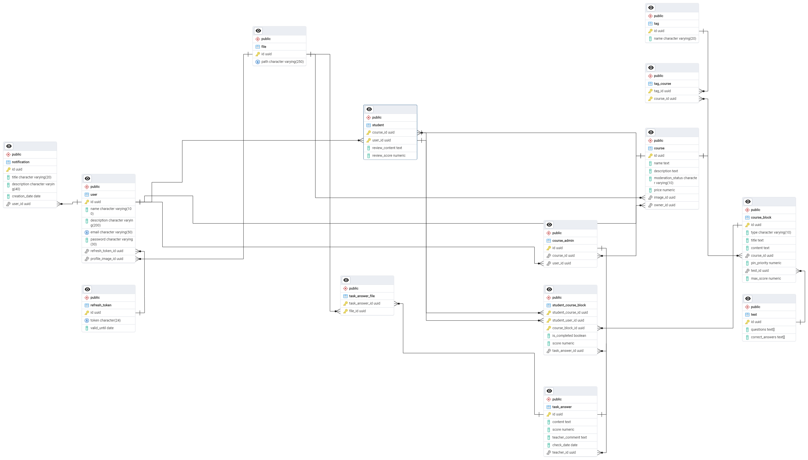

# База данных

## Ограничения
<table>
    <thead>
        <tr>
            <th>Название таблицы</th>
            <th>Ограничения</th>
        </tr>
    </thead>
    <tbody>
        <tr>
            <td rowspan=3 align="center">course_block</td>
            <td align="center">pin_priority >= 0</td>
        </tr>
        <tr>
            <td align="center">type = info | theory | task</td>
        </tr>
        <tr>
            <td align="center">max_score = null | > 0</td>
        </tr>
        <tr>
            <td align="center">student_course_block</td>
            <td align="center">score < max_score (из course_block)</td>
        </tr>
        <tr>
            <td align="center">task_answer</td>
            <td align="center">content хранит HTML</td>
        </tr>
        <tr>
            <td align="center">course_block</td>
            <td align="center">content хранит HTML</td>
        </tr>
    </tbody>
</table>

**Примечание**: ограничения на длины строк смотрите по схеме!
